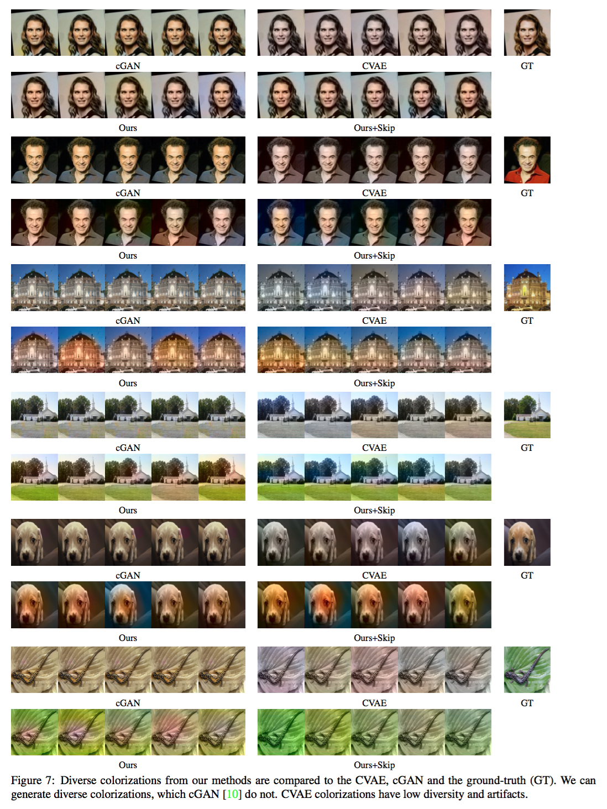

Tensorflow implementation of Deshpande et al. "[Learning Diverse Image Colorization](https://arxiv.org/abs/1612.01958)"                 

The code is tested for Tensorflow v1.0.1 and python-2.7

Fetch lfw dataset by

```
bash get_data.sh
```

Execute run.sh to first train vae+mdn and then, generate results for test set

```
bash run.sh
```

If you use this code, please cite                                                                   
                                                                                                    
```
@inproceedings{DeshpandeLDColor17,                                                                  
  author = {Aditya Deshpande, Jiajun Lu, Mao-Chuang Yeh, Min Jin Chong and David Forsyth},          
  title = {Learning Diverse Image Colorization},                                                    
  booktitle={Computer Vision and Pattern Recognition},                                              
  url={https://arxiv.org/abs/1612.01958},                                                           
  year={2017}                                                                                       
} 
```

Some examples of diverse colorizations on LFW, LSUN Church and ImageNet-Val dataset

<p align='center'>

</p>
